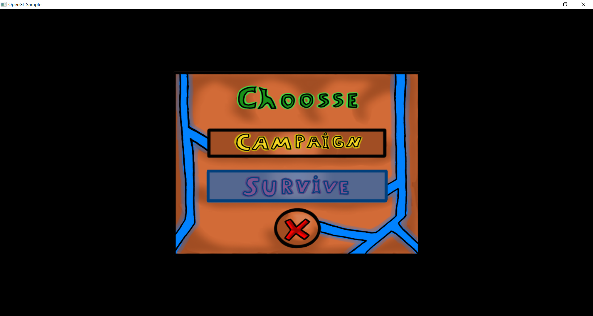
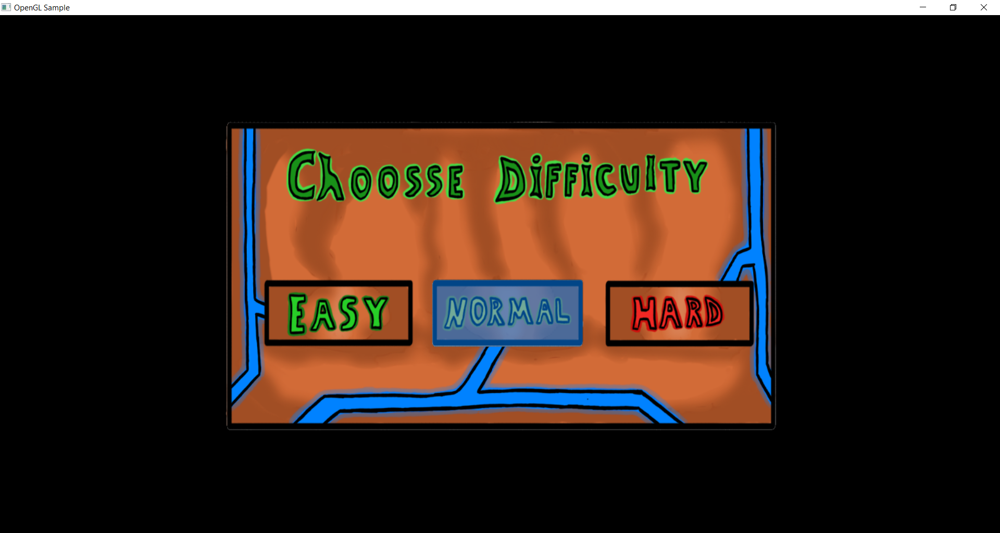
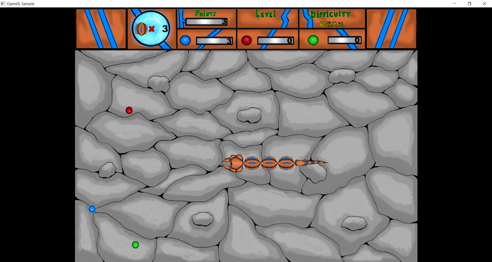
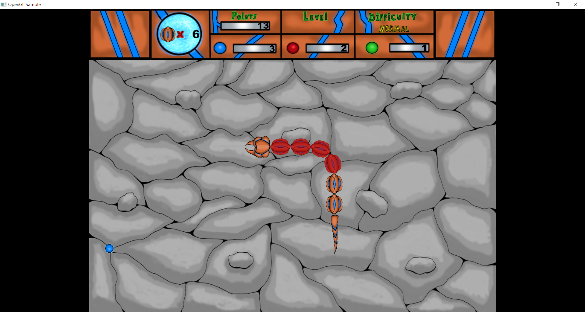
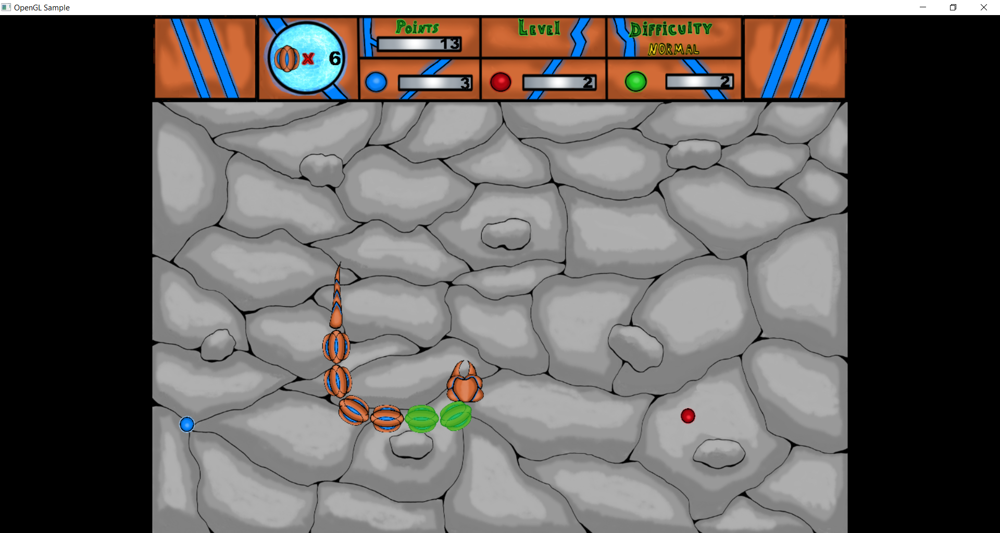
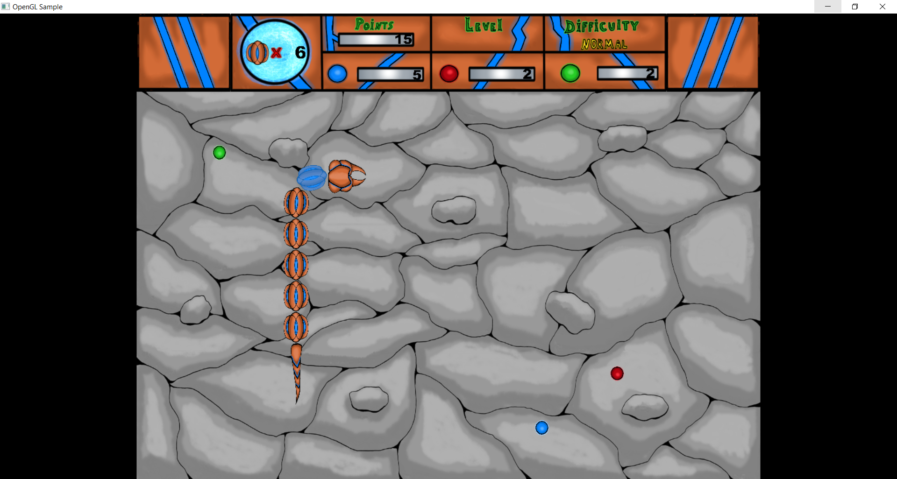
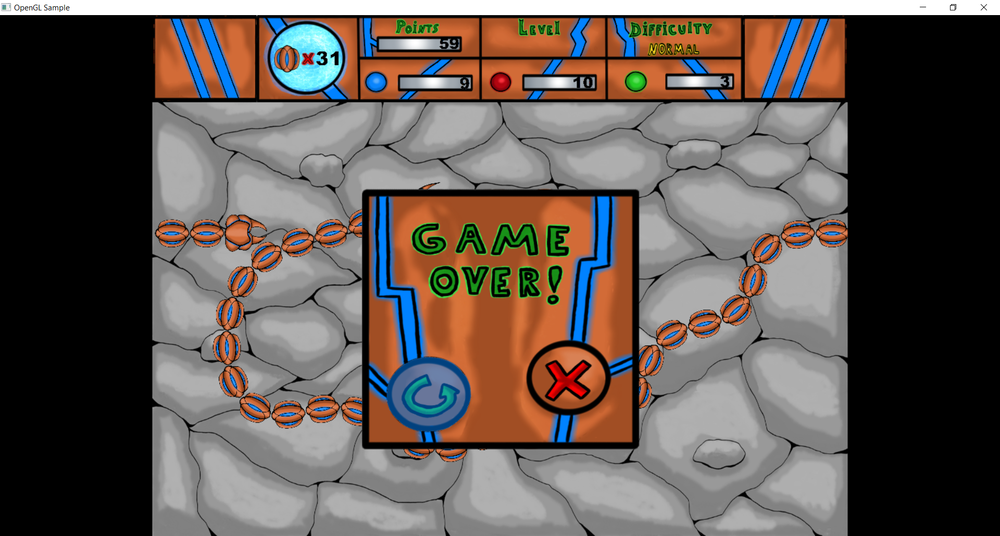
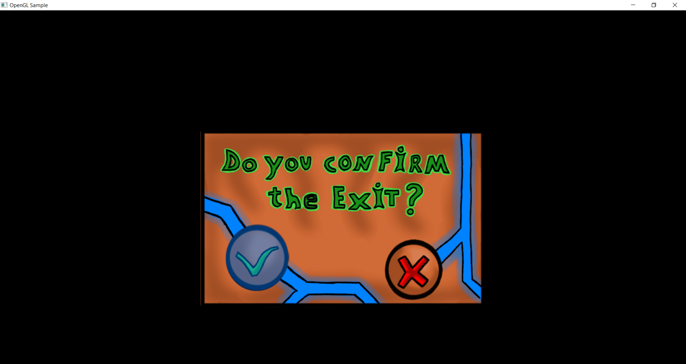

# Snake_OpenGL
2D snake game implemented using C/C++, OpenGl and WinAPP.
## Description
A large and complex 2D computer game project using OpenGL. Unlike most games of this genre , 
snake moves in coordinates on a plane and turns are calculated using trigonometric functions . 
The application consists of 14 files linked by dependencies implementing the State Machine design pattern.
## Images

